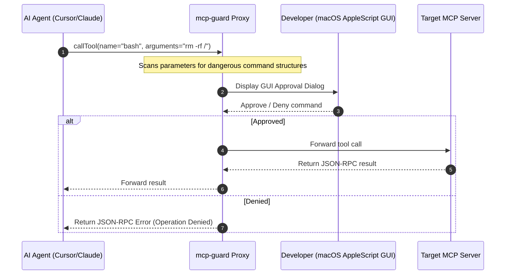

<p align="center">
  <h1 align="center">🛡️ mcp-guard</h1>
  <p align="center">
    <strong>The Lightweight Local Firewall & Permission Gateway for AI Coding Agents.</strong>
  </p>
  <p align="center">
    <a href="https://github.com/shivamtyagi18/mcp-guard/stargazers"></a>
    <a href="https://github.com/shivamtyagi18/mcp-guard/blob/main/LICENSE"></a>
    
  </p>
</p>

---

## 🚀 What is mcp-guard?

**mcp-guard** sits directly between your AI editor/agent (Cursor, Claude Code, Windsurf) and your local MCP servers, acting as a security proxy gateway. It monitors incoming JSON-RPC tool calls, evaluates risk patterns, and prompts you for confirmation via native macOS dialogs before executing dangerous commands.



---

## ✨ Features

*   **🔒 Interception Proxy**: Intercepts `stdin`/`stdout` streams between client and target servers with zero-latency forwarding for safe tools.
*   **⚠️ Smart Risk Classification**: Instantly flags hazardous commands like shell execution (`bash`, `run`), package installers (`npm`, `pip`), or file manipulations.
*   **🛡️ Parameter Auditing**: Regular expression scanner intercepts arguments containing `rm -rf`, `sudo`, or access to system directories.
*   **💻 Native Prompts**: Prompts the developer via macOS **AppleScript GUI Dialogs** (allowing background approvals) or falls back to `/dev/tty` CLI prompt.
*   **⚙️ Project-Local Settings**: Define custom rules per project (`.mcp-guard.json`) or globally (`~/.config/mcp-guard/config.json`).

---

## 📦 Quick Start

### Installation
```bash
npm install -g mcp-guard
```

### Usage
Start any MCP server wrapped in `mcp-guard`:

```bash
# Wrap a local SQLite MCP server
mcp-guard --sqlite-mcp-server --db path/to/db.sqlite
```

Or configure your editor's MCP server settings to use `mcp-guard`:

```json
"mcpServers": {
  "my-sqlite-server": {
    "command": "mcp-guard",
    "args": ["--", "npx", "-y", "@modelcontextprotocol/server-sqlite", "--db", "my.db"]
  }
}
```

---

## 🤝 Contributing

Contributions are welcome! Feel free to open an issue or submit a pull request. 

Give us a star ⭐ if you find this tool helpful!
